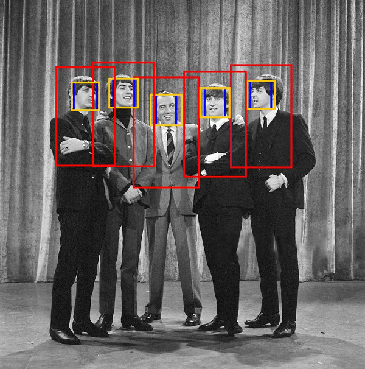

# About

Some ImageUtils and ImagesFolderUtils methods implemented in Java and Kotlin.

## ImagesUtils

Methods to resize, compress, rotate, etc. individual images (in Java).

## ImagesFolderUtils

Methods that apply operation on an input folder (and its sub-folders recursively) containing images (in Kotlin).
It doesn't override the original images, but create an output folder with the processed images.

- List all images in folders and sub-folders:

      File.listAllImages()
    
- Crop all images found in input folder to proportions (e.g. 1x1, 16x9, etc.):    
    
      File.cropImagesToProportions(x: Int, y: Int)

- Resize all images found in input folder:

      File.resizeImagesTo(width: Int, height: Int)

## FaceUtils

Crop pictures around the faces, based on information contained in a CSV file. 
You can build such a CSV with this project: https://github.com/benckx/tensorflow-face-detection

    FaceUtils.reFrameAroundFace(csv: String, frame: ImageContainingFace, output: String)
    
For example, with this input image and frame (frames added for visualization purpose):

    val WAIST_LEVEL = ImageContainingFace(640, 1080, Face(Rectangle(170, 170, 300, 300)))

It will extract the following:

# Import with Gradle

    repositories {
        maven { url "https://jitpack.io" }
    }
    
    dependencies {
        compile "com.github.benckx:iapetus-images:master-SNAPSHOT"
    }
